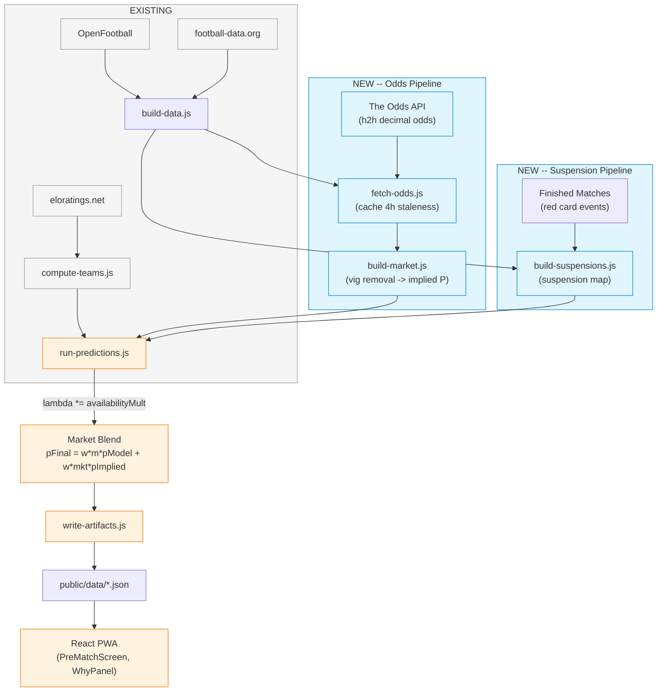

# Plan: Data Accuracy Upgrade (Phase 1)

## Overview

Integrate two real-world data sources into the World Cup 2026 prediction pipeline:
1. **The Odds API** -- betting odds converted to implied probabilities, blended with model predictions
2. **Card-suspension engine** -- red-card tracking that reduces lambda via availabilityMult

Both run at build time only. Client consumes static JSON.

## Architecture

### New Files

| File | Purpose |
|------|---------|
| `scripts/lib/fetch-odds.js` | Fetch h2h odds from The Odds API, cache to scripts/cache/ |
| `scripts/lib/build-market.js` | Remove vig, compute implied probabilities, match to teams |
| `scripts/lib/build-suspensions.js` | Track red cards from finished matches, compute suspension map |
| `scripts/data/SOURCES.md` | Document all data sources, licenses, and derivation methods |
| `scripts/__tests__/build-market.test.js` | Unit tests for vig removal and implied probability computation |
| `scripts/__tests__/build-suspensions.test.js` | Unit tests for suspension tracking logic |

### Modified Files

| File | Change |
|------|--------|
| `scripts/build-data.js` | Wire in fetch-odds, build-market, build-suspensions steps |
| `scripts/lib/run-predictions.js` | Add availabilityMult to lambda; add market blend post-processing |
| `scripts/lib/write-artifacts.js` | Write market.json to public/data/; update calibration for blended probs |
| `src/engine/calibrate.js` | Add optional `availabilityMult` param to `getTeamLambda` |
| `src/components/WhyPanel/index.jsx` | Render suspension and market factors in the chain |
| `src/screens/PreMatchScreen/index.jsx` | Load market.json; pass to WhyPanel |
| `src/i18n/en.json` | Add factor labels for market and suspension |
| `src/i18n/he.json` | Add Hebrew labels for market and suspension |
| `.github/workflows/update-data.yml` | Add ODDS_API_KEY env var |

### Unchanged (safety check)

| File | Reason |
|------|--------|
| `src/engine/knockout.js` | Uses lambda directly; no signature change needed |
| `src/engine/poisson-dc.js` | Pure math; no changes |
| `src/hooks/useData.js` | Generic fetcher; no changes |

## Data Flow

### Odds Pipeline

```
The Odds API (h2h, decimal odds)
    |
    v
fetch-odds.js  (cache to scripts/cache/odds.json, staleness guard 4h)
    |
    v
build-market.js
    - Match bookmaker team names to team codes via teams-meta.json
    - Remove vig: impliedP_i = (1/odds_i) / sum(1/odds_j)
    - Average across bookmakers
    - Output: Map<matchId, { pHome, pDraw, pAway }>
    |
    v
run-predictions.js (post-processing)
    - w_market = 0.25 (configurable)
    - pFinal_home = (1 - w_market) * pModel_home + w_market * pImplied_home
    - If no implied P available for match: skip blend, use model-only
    - Store blend weights in prediction.market field
```

### Suspension Pipeline

```
Finished matches (from fetch-results / OpenFootball)
    |
    v
build-suspensions.js
    - Scan match events for red cards
    - Determine which players are suspended for next match
    - Compute availabilityMult per team per upcoming match
    - Default: 1.0 (no suspension)
    - Suspended key player: 0.85-0.95 depending on role
    |
    v
run-predictions.js
    - lambda *= availabilityMult (multiplicative, like form)
    - Add to factor chain for WhyPanel
```

## Key Design Decisions

### 1. Blend as post-processing, not lambda modification

Market odds are blended at the probability level (`pFinal = w*pModel + w*pImplied`), NOT at the lambda level. This is correct because:
- Odds represent P(outcome), not expected goals
- Vig-removed implied P is already a probability distribution
- Blending at the lambda level would double-count (lambda -> Poisson -> probabilities -> blend)

### 2. availabilityMult as lambda multiplier

Suspensions affect team strength, which maps naturally to lambda (expected goals). A red-card suspension of a key player reduces the team's expected goal output. This is applied multiplicatively to lambda, consistent with how attack/defence/form work.

### 3. Staleness guard for odds

The Odds API free tier = 500 credits/month. With 30-min cron = ~1,440 builds/month. Cache odds for 4 hours (6 builds/day * 30 days = 180 credits/month, well within free tier).

### 4. Store only implied probabilities

The Odds API ToS prohibits redistributing raw odds. Only derived implied probabilities (after vig removal) are written to `public/data/market.json`. No raw decimal odds are stored in the output.

### 5. Shared engine parameter safety

`getTeamLambda` gains an optional `availabilityMult` parameter with default value 1.0. This ensures all existing callers (including the React client's direct usage in tests) continue working without changes.

## Vig Removal Algorithm

Standard method:
```
overround = sum(1/odds_i)  // always > 1.0 due to bookmaker margin
impliedP_i = (1/odds_i) / overround
```

Example: odds = [1.80, 3.50, 4.50]
- raw: 1/1.80 = 0.556, 1/3.50 = 0.286, 1/4.50 = 0.222
- overround = 1.064
- implied: 0.522, 0.269, 0.209 (sum = 1.000)

For multiple bookmakers: compute implied P per bookmaker, then average.

## Suspension Logic

During the tournament, red cards result in automatic 1-match suspensions. The suspension engine:
1. Scans finished matches for red card events
2. Maps suspended players to their team
3. Computes `availabilityMult`:
   - No suspension: 1.0
   - Key player suspended (by FIFA ranking > top 11): 0.90
   - Squad player suspended: 0.95
   - Multiple suspensions: cumulative (0.90 * 0.95 = 0.855)

Initially, since detailed player data is not yet available, we use a simplified model:
- Team had a red card in previous match -> availabilityMult = 0.92
- No red card -> 1.0

## Diagram

### Mermaid



### ASCII Art

```text
+==================+     +==================+     +==================+
| EXISTING         |     | NEW -- Odds      |     | NEW -- Susp.     |
|                  |     |                  |     |                  |
| eloratings.net   |     | The Odds API     |     | Finished Matches |
|        |         |     | (h2h odds)       |     | (red cards)      |
|        v         |     |        |         |     |        |         |
| compute-teams.js |     |        v         |     |        v         |
|        |         |     | fetch-odds.js    |     | build-           |
|        |         |     | (4h staleness)   |     | suspensions.js   |
+--------+---------+     |        |         |     +--------+---------+
         |               |        v         |              |
         |               | build-market.js  |              |
         |               | (vig -> impl. P) |              |
         |               +--------+---------+              |
         |                        |                        |
         |         +--------------+-----------+------------+
         |         |                          |
         v         v                          v
+------------------+    +--------------------------------+
| build-data.js    |--->| run-predictions.js             |
| (orchestrator)   |    |                                |
+------------------+    | 1. lambda *= availabilityMult  |
                        | 2. pFinal = w_m*pModel         |
                        |         + w_mkt*pImplied       |
                        +----------------+---------------+
                                         |
                                         v
                        +----------------+---------------+
                        | write-artifacts.js             |
                        | (market.json, predictions.json) |
                        +----------------+---------------+
                                         |
                                         v
                        +----------------+---------------+
                        | public/data/*.json             |
                        | (static, no raw odds)           |
                        +----------------+---------------+
                                         |
                                         v
                        +----------------+---------------+
                        | React PWA                      |
                        | PreMatchScreen -> WhyPanel     |
                        | (shows market + suspension)    |
                        +--------------------------------+
```

## Blast Radius

```
BLAST RADIUS -- data-accuracy-upgrade (Phase 1)

  Direct impact:
    scripts/lib/run-predictions.js (MODIFY) -> used by 1 consumer (build-data.js)
    scripts/lib/write-artifacts.js (MODIFY) -> used by 1 consumer (build-data.js)
    scripts/build-data.js (MODIFY) -> used by 1 consumer (update-data.yml)
    src/engine/calibrate.js (MODIFY) -> used by 3 consumers (run-predictions, compute-teams, __tests__/calibrate.test.js)
    src/components/WhyPanel/index.jsx (MODIFY) -> used by 1 consumer (PreMatchScreen)
    src/screens/PreMatchScreen/index.jsx (MODIFY) -> no other importers
    src/i18n/en.json (MODIFY) -> used by 1 consumer (i18n/index.js)
    src/i18n/he.json (MODIFY) -> used by 1 consumer (i18n/index.js)
    .github/workflows/update-data.yml (MODIFY) -> no importers

  Transitive impact:
    src/engine/knockout.js -> calls getTeamLambda indirectly via run-predictions (no change needed)
    src/engine/__tests__/calibrate.test.js -> tests getTeamLambda (must pass with default params)
    src/screens/TeamScreen -> displays team data (no prediction changes needed)

  Risk areas:
    src/engine/calibrate.js has 100% test coverage for getTeamLambda -- new param must be optional
    src/components/WhyPanel renders chain items generically -- new factor keys auto-render with i18n fallback
    No integration tests exist for the build pipeline -- adding new build steps without integration coverage

  Architectural compliance:
    [OK] Fetcher pattern matches fetch-elo.js and fetch-results.js (safeFetch + cache)
    [OK] Build-module pattern matches compute-teams.js (pure function, no side effects)
    [OK] WhyPanel factor chain pattern (key + label + mult) followed
    [OK] i18n pattern (factor.{key}) followed
    [WARN] build-market.js needs a team-name-to-code matcher; OpenFootball's buildNameToCodeMap
           is inside fetch-openfootball.js (consider extracting or duplicating minimally)

SECURITY IMPACT:
  scripts/lib/fetch-odds.js (ODDS_API_KEY handling) -> LOW
    Reachable from: build-data.js (CI only, not client)
    Risk: API key could leak if logged or committed
    Recommendation: Use process.env, never log key value, add to .gitignore if cached with key

  src/engine/calibrate.js (availabilityMult param) -> LOW
    Reachable from: Both build scripts and React client
    Risk: No security impact (pure math function)
```
