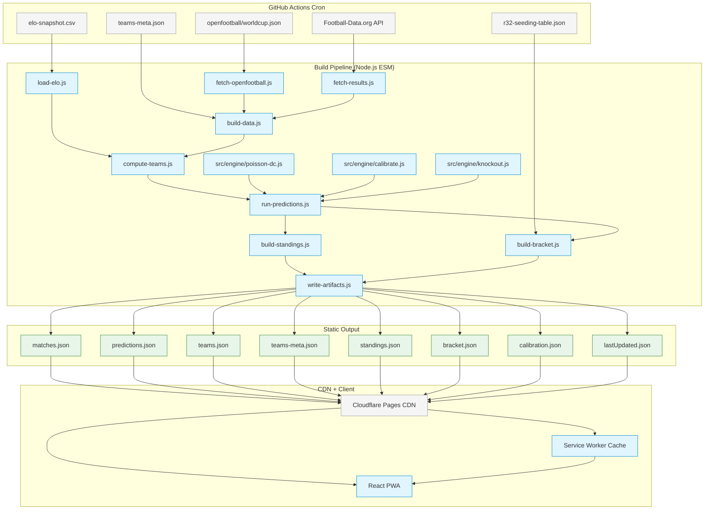

# Plan — Mundial 2026 Predictor

## Overview

Greenfield World Cup 2026 prediction app. Static PWA (React + Vite) with a Node.js ESM build pipeline. Dixon-Coles Poisson model for match prediction. No backend, no database, no user accounts.

## Architecture

### Macro Architecture

Static-first: GitHub Actions cron runs build script, writes JSON to `public/data/`, deploys to Cloudflare Pages CDN. React PWA reads JSON client-side.

### Tech Stack

| Layer | Choice | Reason |
|---|---|---|
| Frontend | React + Vite | Fast builds, PWA plugin support |
| Styling | CSS Modules + CSS Variables | Zero runtime, theme swap via var() |
| Routing | React Router v6 (hash mode) | Works on static CDN |
| State | React Context + localStorage | Small scope, no external lib needed |
| i18n | react-i18next | RTL support, well-maintained |
| PWA | vite-plugin-pwa | One-line Vite integration |
| Build scripts | Node.js ESM | Runs in GitHub Actions |
| Hosting | Cloudflare Pages | Free, fast CDN |
| Cron | GitHub Actions | Free 2000 min/month |

### Data Flow

1. Build script fetches from openfootball/worldcup.json + Football-Data.org API
2. Elo ratings from committed CSV (no live scraping)
3. Dixon-Coles engine computes predictions for all 104 matches
4. 7 JSON files written to `public/data/`
5. Git push to repo triggers Cloudflare Pages deploy
6. PWA loads JSON client-side, caches via service worker

### Key Modules

| Module | Responsibility |
|---|---|
| `src/engine/poisson-dc.js` | Core Poisson grid + Dixon-Coles correction |
| `src/engine/calibrate.js` | Elo-to-lambda conversion, time-decay weights |
| `src/engine/knockout.js` | Knockout qualify probability (incl. penalties) |
| `scripts/build-data.js` | Main build orchestrator |
| `scripts/lib/fetch-openfootball.js` | Fetch fixture data |
| `scripts/lib/fetch-results.js` | Fetch match results (Football-Data.org) |
| `scripts/lib/run-predictions.js` | Run Dixon-Coles for all matches |
| `scripts/lib/build-standings.js` | Group tables + 3rd-place ranking |
| `scripts/lib/build-bracket.js` | Knockout tree resolution |

---

## Diagram

<!-- Legend: blue = new component, grey = external data source, orange = config -->



```text
+----------------------------------------------------------+
|  GitHub Actions Cron (every 30 min during tournament)    |
|                                                          |
|  [openfootball]  [Football-Data.org]  [elo-snapshot.csv]|
|       |                  |                    |          |
+-------+------------------+--------------------+----------+
        |                  |                    |
        v                  v                    v
+----------------------------------------------------------+
|  Build Pipeline (Node.js ESM)                            |
|                                                          |
|  fetch-openfootball   fetch-results   load-elo           |
|        |                  |              |                |
|        +------------------+--------------+                |
|                          |                               |
|                     compute-teams                         |
|                          |                               |
|            +--- poisson-dc.js ---+                        |
|            |   calibrate.js      |                        |
|            |   knockout.js       |                        |
|            +----------+----------+                        |
|                       |                                  |
|              run-predictions                               |
|              /            \                               |
|     build-standings   build-bracket                       |
|              \            /                               |
|           write-artifacts                                 |
+---------------------+------------------------------------+
                      |
                      v
+----------------------------------------------------------+
|  public/data/ (7 JSON files)                              |
|  matches | predictions | teams | teams-meta               |
|  standings | bracket | calibration | lastUpdated          |
+---------------------+------------------------------------+
                      |
                      v
+----------------------------------------------------------+
|  Cloudflare Pages CDN                                    |
|         |                                |               |
|    React PWA  <---  Service Worker Cache                  |
+----------------------------------------------------------+
```

### Client Architecture (React)

```text
+----------------------------------------------------------+
|  App.jsx (React Router v6, hash mode)                    |
|                                                          |
|  useTheme ----+                                          |
|  useLang  ----+----> Context Providers                   |
|  useData  ----+                                          |
|  useGuess ----+                                          |
|                                                          |
|  Routes:                                                 |
|  +-------------+  +---------------+  +--------------+    |
|  | HomeScreen  |  | PreMatchScreen|  | TeamScreen   |    |
|  | (match list)|  | (prediction)  |  | (team detail)|    |
|  +-------------+  +---------------+  +--------------+    |
|                                                          |
|  +---------------+  +----------------+                   |
|  | BracketScreen |  | TeamPickerScren|                   |
|  | (bracket tree)|  | (settings)     |                   |
|  +---------------+  +----------------+                   |
+----------------------------------------------------------+
```

---

## Blast Radius

```
BLAST RADIUS — Mundial 2026 Predictor (GREENFIELD)

  Direct impact:
    All files are NEW (greenfield project — no existing consumers)

  New modules created:
    src/engine/poisson-dc.js          (NEW) → shared with build script + client
    src/engine/calibrate.js           (NEW) → consumed by run-predictions.js
    src/engine/knockout.js            (NEW) → consumed by run-predictions.js
    scripts/build-data.js             (NEW) → orchestrates all build steps
    scripts/lib/fetch-openfootball.js (NEW) → consumed by build-data.js
    scripts/lib/fetch-results.js      (NEW) → consumed by build-data.js
    scripts/lib/load-elo.js           (NEW) → consumed by build-data.js
    scripts/lib/compute-teams.js      (NEW) → consumed by build-data.js
    scripts/lib/run-predictions.js    (NEW) → consumes engine module
    scripts/lib/build-standings.js    (NEW) → consumed by build-data.js
    scripts/lib/build-bracket.js      (NEW) → consumed by build-data.js
    scripts/lib/write-artifacts.js    (NEW) → consumed by build-data.js
    src/hooks/useData.js              (NEW) → consumed by all screens
    src/hooks/useTheme.js             (NEW) → consumed by App.jsx
    src/hooks/useLang.js              (NEW) → consumed by App.jsx
    src/hooks/useGuess.js             (NEW) → consumed by PreMatchScreen
    ~25 React components              (NEW) → consumed by 5 screens
    5 screen modules                  (NEW) → consumed by React Router
    share/renderToImage.js            (NEW) → consumed by share components
    i18n/he.json + en.json + index.js (NEW) → consumed by useLang

  Shared code boundary:
    src/engine/poisson-dc.js is imported by BOTH:
      - scripts/lib/run-predictions.js (Node.js ESM build script)
      - src/screens/PreMatchScreen.jsx (browser client)
    This dual-environment import is a key integration risk.

  Data contract (JSON files are the API between build and client):
    predictions.json schema → consumed by PreMatchScreen, BracketScreen
    matches.json schema    → consumed by HomeScreen, PreMatchScreen
    standings.json schema  → consumed by BracketScreen (3rd-place ranking)
    bracket.json schema    → consumed by BracketScreen
    teams.json schema      → consumed by TeamScreen, PreMatchScreen
    Any schema change in build output requires matching client changes.

  Risk areas:
    No test coverage exists yet (greenfield)
    External API dependencies (Football-Data.org, openfootball) may be unavailable
    Mathematical correctness of Dixon-Coles engine is critical and non-obvious
    RTL/Hebrew i18n requires careful CSS handling (margin/padding flips)
    Share card rendering depends on crossOrigin flags and font preloading

  Architectural compliance:
    + Static-first architecture (no backend)
    + Separation of fetch (build) from serve (CDN)
    + localStorage for all user state (no accounts)
    + Shared engine code between build and client
    ! Dual-environment import (Node.js + browser) needs careful ESM setup
    ! CSS Variables approach for theming is correct but needs RTL testing
```

---

## Security Impact

```
SECURITY IMPACT — Mundial 2026 Predictor

  No CRITICAL or HIGH security hot paths.

  MEDIUM:
    scripts/lib/fetch-results.js (API key handling) → MEDIUM
      Reachable from: GitHub Actions (INTERNAL)
      Risk: Football-Data.org API key exposed in logs or committed to repo
      Recommendation: Ensure FD_API_KEY is only in GitHub Secrets, never logged.
      Verify .gitignore excludes .env files.

    scripts/cache/ (fallback data) → MEDIUM
      Reachable from: Build script (INTERNAL)
      Risk: Cached data could be stale/manipulated if repo compromised
      Recommendation: Verify JSON integrity in build script (checksums optional)

  LOW:
    All other files — no auth, no payment, no PII, no user accounts
    User state is limited to localStorage (theme, language, guesses)
```

---

## Risk Assessment

| Risk | Level | Mitigation |
|---|---|---|
| Dixon-Coles math correctness | HIGH | Comprehensive unit tests before any UI work |
| Third-place ranking algorithm | MEDIUM | Test with all tiebreaker scenarios |
| External API unavailability | MEDIUM | Graceful fallback to cached data in build script |
| Elo CSV staleness | LOW | Manual process, documented update cadence |
| Share card rendering (crossOrigin) | LOW | Canvas fallback pipeline |
| RTL layout bugs | LOW | Test both directions in development |
| Dual-environment ESM import | LOW | Validate engine works in Node and browser |
| 48-team data completeness | LOW | Validation step in build pipeline |

**Overall Risk: MEDIUM** — No security-critical paths, but mathematical correctness and external API dependencies require careful testing.

---

## File Plan

### Files to Create (~65 files)

**Engine (shared build + client):**
- `src/engine/poisson-dc.js` — Scenario: "Dixon-Coles probabilities sum to 1", "Dixon-Coles correction only affects low-score cells", "Strong team has higher win probability"
- `src/engine/calibrate.js` — Scenario: "Elo-to-lambda conversion produces reasonable expected goals"
- `src/engine/knockout.js` — Scenario: "Knockout qualify probabilities include penalties"
- `src/engine/__tests__/poisson-dc.test.js` — Infrastructure: required by engine validation
- `src/engine/__tests__/calibrate.test.js` — Infrastructure: required by engine validation
- `src/engine/__tests__/knockout.test.js` — Infrastructure: required by engine validation

**Build scripts:**
- `scripts/build-data.js` — Scenario: "Build script produces valid output"
- `scripts/lib/fetch-openfootball.js` — Infrastructure: required by build-data.js
- `scripts/lib/fetch-results.js` — Scenario: "Rate limiting protects Football-Data.org API calls", "Build script handles API failure gracefully"
- `scripts/lib/load-elo.js` — Infrastructure: required by compute-teams.js
- `scripts/lib/compute-teams.js` — Infrastructure: required by run-predictions.js
- `scripts/lib/run-predictions.js` — Scenario: "Build script produces valid output"
- `scripts/lib/build-standings.js` — Scenario: "Group standings sort with 5-criteria tiebreaker", "Best 3rd-place teams advance correctly"
- `scripts/lib/build-bracket.js` — Scenario: "Round-of-32 seeding table resolves correctly"
- `scripts/lib/write-artifacts.js` — Infrastructure: required by build pipeline
- `scripts/__tests__/build-standings.test.js` — Infrastructure: required by standings validation
- `scripts/__tests__/build-bracket.test.js` — Infrastructure: required by bracket validation
- `scripts/__tests__/build-data.test.js` — Infrastructure: required by integration test

**Data files:**
- `scripts/data/elo-snapshot.csv` — Infrastructure: required by load-elo.js
- `scripts/data/teams-meta.json` — Infrastructure: required by build pipeline + client
- `scripts/data/r32-seeding-table.json` — Infrastructure: required by build-bracket.js

**Config/Infra:**
- `package.json` — Infrastructure: project manifest
- `vite.config.js` — Infrastructure: build configuration
- `.github/workflows/update-data.yml` — Infrastructure: CI/CD cron
- `public/manifest.json` (or PWA config in vite) — Infrastructure: PWA manifest
- `public/icon-192.png`, `public/icon-512.png` — Infrastructure: PWA icons

**Hooks:**
- `src/hooks/useData.js` — Scenario: "User views pre-match prediction", "App works offline"
- `src/hooks/useTheme.js` — Scenario: "User selects a team theme"
- `src/hooks/useLang.js` — Scenario: "User switches language"
- `src/hooks/useGuess.js` — Scenario: "User submits a score guess"

**Components (~25):**
- `src/components/Flag/` — Scenario: "User views pre-match prediction"
- `src/components/FormDot/`, `FormRow/` — Scenario: "User views pre-match prediction"
- `src/components/MiniLean/`, `PredictionBars/` — Scenario: "User views pre-match prediction"
- `src/components/PredictionDonut/` — Scenario: "User views pre-match prediction"
- `src/components/ScorelineGrid/` — Scenario: "User views pre-match prediction"
- `src/components/Card/`, `Btn/`, `Pitch/`, `Ico/` — Infrastructure: required by all screens
- `src/components/StageChip/`, `Skeleton/`, `CalibrationBadge/` — Scenario: "User views pre-match prediction"
- `src/components/WhyPanel/` — Scenario: "User views pre-match prediction"
- `src/components/DigitStepper/`, `LikelyScores/` — Scenario: "User views pre-match prediction"
- `src/components/GuessArea/` — Scenario: "User submits a score guess"
- `src/components/FeedbackCard/`, `ResultCard/` — Scenario: "User submits a score guess"
- `src/components/TeamCompare/` — Scenario: "User views pre-match prediction"
- `src/components/MatchCard/`, `FilterBar/` — Scenario: "User views pre-match prediction"
- `src/components/BracketTie/`, `Trophy/` — Scenario: "User overrides bracket slot"

**Screens (5):**
- `src/screens/HomeScreen/` — Scenario: "User views pre-match prediction"
- `src/screens/PreMatchScreen/` — Scenario: "User views pre-match prediction", "User submits a score guess"
- `src/screens/TeamScreen/` — Scenario: "User views pre-match prediction" (team detail)
- `src/screens/TeamPickerScreen/` — Scenario: "User switches language", "User selects a team theme"
- `src/screens/BracketScreen/` — Scenario: "User overrides bracket slot"

**Share:**
- `src/share/ShareCardSquare/` — Scenario: "User shares match prediction"
- `src/share/BracketCard/` — Scenario: "User shares bracket"
- `src/share/renderToImage.js` — Scenario: "User shares match prediction", "User shares bracket"

**i18n:**
- `src/i18n/he.json` — Scenario: "User switches language"
- `src/i18n/en.json` — Scenario: "User switches language"
- `src/i18n/index.js` — Infrastructure: required by useLang hook

**Entry + styles:**
- `src/main.jsx` — Infrastructure: app entry point
- `src/App.jsx` — Infrastructure: router + providers
- `src/theme.css` — Scenario: "User selects a team theme"
- `src/index.css` — Infrastructure: global reset

### Files to Modify

None — greenfield project.
